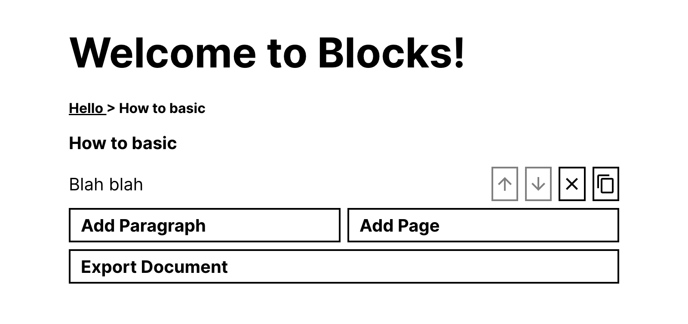

# blocks

This is an exercise in a client-side API for a block-based notes app (i.e. Notion Ultra-Lite).



## How to run

The API is located in the `src/lib/` directory, with some tests alongside source code, but to really try blocks out, it's best to run the demo React app. It's built with [Vite](https://vitejs.dev/), and it's both quick and easy. Simply:

1. Install dependencies. I prefer `pnpm`, as it uses a particularly efficient and convenient data structure for storing installed modules, but `npm` or `yarn` will work just the same:

    ```bash
    pnpm install
    ```

2. Run the development server:

    ```bash
    pnpm run dev
    ```

3. Voilà, simply go to the address shown in the console.
